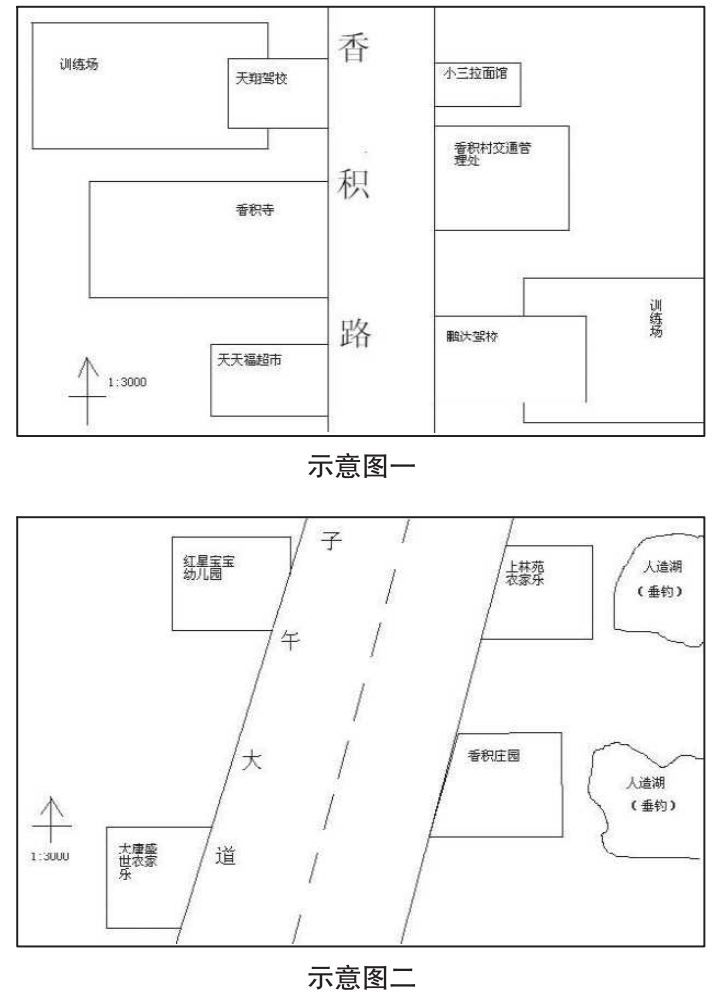

    <iframe id='head' align="center" width="100%" height="160" src=""  frameborder="no" border="0" marginwidth="0" marginheight="px" scrolling="no"></iframe>

  

【6】

买了读卡器，你来到小巷子内一家烟雾缭绕的网吧。

果然没有空机器，跟料想中一样人满为患。网吧暖气开得很足，每个人都面红耳赤、汗流浃背。正在你手足无措之时，却看到你们宿舍的舍长叼着烟坐在一台机子前。他看到你，喜上眉梢，叫道：“你怎么来了？赶紧dota，正缺人呢。”

你说道：“没机子了，而且我现在有急事，关于党静的，借机子用一下。”

舍长马上给你让出座位。你插上蓝色内存卡，打开文件，里面果然是一堆照片。和你想的一样，这就是胡旭宿舍里那相机的内存卡。

一张张照片都是党静和胡旭在一起的自拍照，日期为十二月二十三日晚七点半左右，也就是昨天傍晚。照片中的他们坐在车中，相互给对方拍照，也有靠在一起的大头照。最后一张照片是党静坐在驾驶席上，双手僵硬地扶着方向盘，盯着前方，表情显得很惊慌。透过车窗可以看到外面飘着小雪，周围一片漆黑，只有不远处暗红的灯笼发出幽幽的光芒。那是一扇古式的大门，门匾上隐约写着“香积”两个字。

香积？香积寺？前天晚上党静和胡旭曾经到过香积寺附近？印象中那一带是很偏僻的地方，他们那么晚了去那里做什么？

党静不会开车，为什么坐在了驾驶席上？

种种疑惑划过你的脑畔。你打开百度，输入关键词。

香积寺位于古都城南长安区内，修建于唐高宗年间，是个宗教圣地……

慢着！页面中还出现了一个叫做“香积庄园”的地方，是个集垂钓、娱乐、休闲、住宿为一体的农家乐。这里也在长安区内，但和香积寺还是有一定距离的。这几年农家乐在南郊如雨后春笋，成为很多在城市中待腻的人节假日的好去处。

这样想来，门匾上的“香积”应该是指香积庄园——如果党静他们选择外出游玩的话，一座古寺对他们的吸引力又怎么比得上一处休闲场所呢？

为了证实你的想法，你分别打开了这两个地方的地图。（见下图）

你认真地分析着这两幅地图，想要推理出当天他们真正的去处。

突然，你的手机又响了，是眼镜打来的。“不好了，胡旭的车从宿舍楼下开走了！”

“啊？什么时候？”

“就是现在！”

你立即挂断电话，野兽般冲出网吧，从巷子夺路狂奔而出，正好看到胡旭的车从学校门口开出来。

也许这是最后的机会了。你冒死横穿马路，张开双臂截住了他的车。

你凛然站在马路中间，奥迪车放慢了速度，接着向右一拐，绕过你径直向远处驶去。在奥迪车从你身旁擦肩而过的一刹那，你似乎看到漆黑的车窗后党静那冰冷绝情的面孔；而驾驶席则坐着一个圣诞老人打扮的人……

……一瞬间，你忽然有种错觉，仿佛党静曾经是上天给你的礼物，如今圣诞老人又从你手中将她接走了……

……惠风和煦，你骑着红色的自行车载着党静向郊外前进，她在你身后紧紧地抱着你，将头依偎在你后背。你因为后背流汗显得很窘迫，而她的手却温柔地擦拭着你流出的汗水。

记忆由模糊变得清晰，继而变得锋利，最后爆裂成惨不忍睹的碎片……

你收拾起痛苦，红着眼拦住一辆出租车。“师傅，追上前面那辆奥迪！”

车内播放着嘈杂的摇滚乐，司机师傅摇头晃脑地说：“哦？哪辆奥迪？”

你向前看去，路上早已不见车的踪影。

你思索了一下，然后说道：“去×××。”

司机师傅说：“好嘞，坐好了！”一脚油门下去。车轮在雪里空转了几圈后飙了出去。

你决定——

 

* 【[去香积寺](9)】
   
* 【[香积庄园](10)】