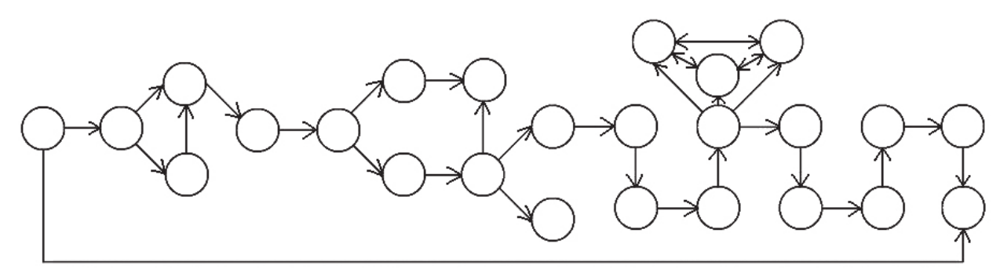

    <iframe id='head' align="center" width="100%" height="160" src=""  frameborder="no" border="0" marginwidth="0" marginheight="px" scrolling="no"></iframe>

  

【一些执念】

这是2011年买的《推理世界》杂志上的一篇小说，当时看完属实是惊为天人。

因为自己本来阅读量就少，那个时候也是第一次见到这种互动的推理小说，阅读体验真的很好√

这么多年过去了，这种创作者与阅读者的互动也不再是什么新奇的事，甚至互动视频都已经各种泛滥了。但是就突然想起来了这样一篇十一年前就带给我强烈代入感和紧张感的小说，就想把它展现出来。

花了一个晚上来整理内容并放在网页上。尝试从纸质阅读变成网页阅读，一方面是方便分享，另一方面是方便做页面跳转，不用像纸质版一样反复地翻页。

不过网页阅读也稍微添加了一点点难度。每一段叙事本来都有编号的，但是在跳转的时候并不知道会跳转到哪一个编号的段落。纸质阅读中看编号或许能帮助判断选择，这也算是场外信息了。此外，如果网页阅读遇到不是最终的结局，也会直接跳转到最初的段落，不能像纸质阅读一样只需要往前翻翻回溯到上一轮选择。

在十一年后的今天看来，这一篇故事其实还有一些可以改进的地方，推理元素略显单薄，故事也毕竟俗套。上面的图是本故事的跳转逻辑，一共有25个段落。即使不更改故事的内容，也可以在跳转逻辑上设计得更为精致，更加引人入胜。但是考虑到尊重原作，这里也只是单纯的分享。

再一次感谢陪伴我高中岁月的《推理世界》杂志和创作者们，也感谢帮助这个网页阅读最终能呈现的鱼仔，毕竟花了重金才买到整篇小说的完整内容，也算是再一次支持了一下版权=。=

* 【[回到最初的起点，试试其他支线](1)】