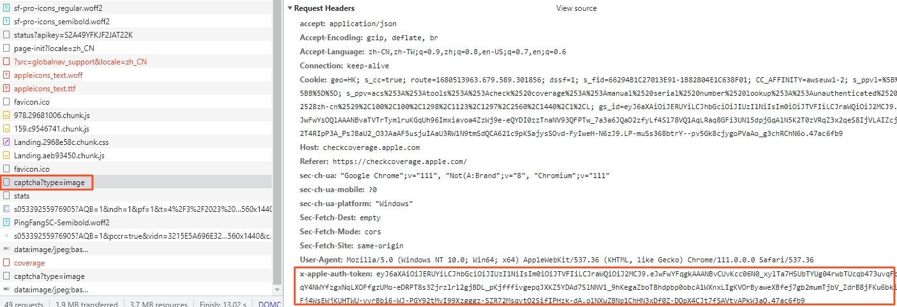
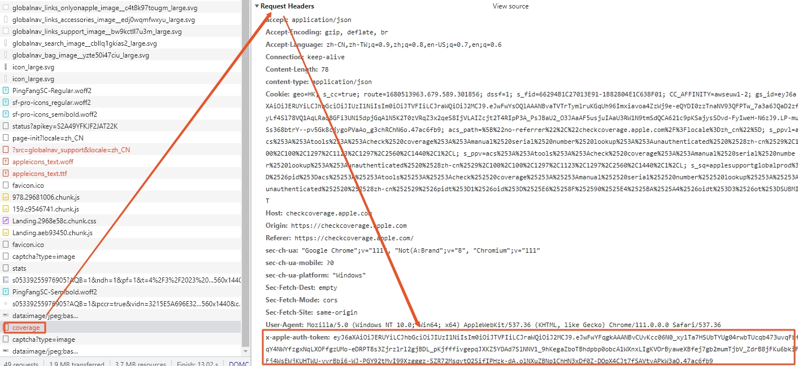
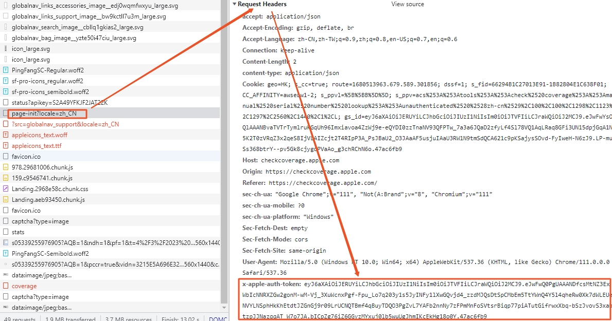

<div id="navifation" class='headbar'>
    <iframe id='head' align="center" width="100%" height="160" src=""  frameborder="no" border="0" marginwidth="0" marginheight="px" scrolling="no" ></iframe>
</div>
<style>
    .headbar{text-align:center;background-color:white}
    .iframe{margin:0 auto;}
</style>
<script>
    var oDiv = document.getElementById('head');
    oDiv.style.position = 'fixed'; oDiv.style.top = '0px'; oDiv.style.left = '0px';
    document.title="苹果官网查询序列号激活";
    document.querySelector("body > div > h1 > a").innerHTML=''
</script>
<br><br>

# 苹果官网查询序列号激活


### 1.环境
* 【官网url】：'https://checkcoverage.apple.com/?locale=zh_CN'
* 【开发环境】：python，selenium，requests
* 【验证码ocr】：ddddocr，或者第三方打码平台

### 2.苹果官网限制

* 每个cookie只能提交五次，验证码刷新也有限制
* 每个ip一般访问200~300次会被禁，大概是禁三天左右


### 3.selenium版本
* 主打一个点点点点
* 稍微需要写一下try-except提升一下每一个子步骤的稳定性，比如验证码识别失败、识别错误等等。考虑到selenium渲染页面很耗时，避免在查询的封装函数外使用try-except
* 保存验证码：验证是base64格式的数据
    ``` python
    # 将data:image/jpeg;base64格式的数据转化为jpg文件
    import base64
    page_content = base64.urlsafe_b64decode(image_url.split(',')[1]) 
    with open('test.jpg', 'wb') as f:
        f.write(page_content)
    ```
* 每次查询都新起一个`browser = webdriver.Chrome(chrome_options=options)`，不会被cookie限制。结束时`browser.quit()`退出后台进程

### 4.requests版本

##### 4.1 查询页面显示

* 页面加载关键的请求：`?locale=zh_CN`，`page-init?locale=zh_CN`，`captcha?type=image`

<center>

</center>

* 提交的请求：`coverage`

##### 4.2 分析步骤

##### 4.2.1 验证码获取

* 首先是要获取验证码的图片。使用点击查看页面上的验证码图片元素，发现是`data:image/jpeg;base64`格式。然后回到请求的页面，查看请求的Response，发现`captcha?type=image`这个请求就是获取验证码图片的GET请求

* 将该请求的Headers全部复制下来，使用requests的GET请求，是能拿到数据的。注释掉Headers中的`Cookie`仍然可以。注释掉Headers中的`x-apple-auth-token`就不行

* 所以重点是要拿到`x-apple-auth-token`的值，理论上在前面的请求中是能找到的。而且猜测每一次会话都是新的值，实际开发过程中，放到第三步再来找值

* 将GET请求的结果保存为jpg图片，即验证码图片，参见上面selenium版本的方法

<center>

</center>

##### 4.2.2 验证码提交

* 随便输入序列号和验证码之后，点击页面上`提交`按钮，可以看到多了一个`coverage`请求。

* 请求的url是`https://checkcoverage.apple.com/api/v1/facade/coverage`，是一个POST请求，Payload可以看到是`{serialNumber: "1234567", captchaAnswer: "www", captchaType: "image"}`

* 将该请求的Headers全部复制下来，使用requests的POST请求，带上正确的序列号和验证码，是能拿到数据的。注释掉Headers中的`Cookie`仍然可以。注释掉Headers中的`x-apple-auth-token`就不行。并且发现这里的`x-apple-auth-token`和上面获取验证码图片的`x-apple-auth-token`是一样

<center>

</center>

* 将POST请求的结果解析成json，则可以提取出想要查询的序列号激活信息


##### 4.2.3 获取`x-apple-auth-token`值

* 在控制台直接搜索`x-apple-auth-token`的值，除了在`captcha?type=image`和`coverage`出现过以外，在`page-init?locale=zh_CN`也出现

* 查看`page-init?locale=zh_CN`的Response，可以看到`x-apple-auth-token`的值就是字段`jwtToken`的值。`page-init?locale=zh_CN`也是一个POST请求，没有payload，因此获取到`page-init?locale=zh_CN`请求的值就能获取`x-apple-auth-token`，也就能获取验证码以及提交验证码

* 然而，想要获取`page-init?locale=zh_CN`请求的值，也需要带上该请求的Headers。发现当前Headers中仍然有`x-apple-auth-token`字段，并且与上面其他两个请求中的`x-apple-auth-token`值不同

<center>

</center>

* 故技重施，在控制台直接搜索`page-init?locale=zh_CN`请求中的`x-apple-auth-token`的值，除了在`page-init?locale=zh_CN`出现过以外，在`?locale=zh_CN`也出现

* 查看`?locale=zh_CN`的Response，可以看到`window.___INITIAL_JWT__`字段就是所找的`x-apple-auth-token`的值。因此获取到`?locale=zh_CN`请求的值，就可以完成后续一些列步骤

* `?locale=zh_CN`是一个GET请求，目标url就是官网查询的url，并且Headers中不带有额外的token，可以使用requests直接发起请求

* 为了保存会话的连续，使用`s=requests.session()`创建会话，再依次发起请求

##### 4.3 完整流程

* GET`https://checkcoverage.apple.com/?locale=zh_CN`，拿到`window.___INITIAL_JWT__`
* 将对应Headers中的`x-apple-auth-token`赋值为`window.___INITIAL_JWT__`，POST`https://checkcoverage.apple.com/api/v1/facade/page-init?locale=zh_CN`，拿到`jwtToken`
* 将对应Headers中的`x-apple-auth-token`赋值为`jwtToken`，GET`https://checkcoverage.apple.com/api/v1/facade/captcha?type=image`拿到验证码图片，并识别
* 将对应Headers中的`x-apple-auth-token`赋值为`jwtToken`,带上正确的序列号和验证码payload`{serialNumber: "1234567", captchaAnswer: "www", captchaType: "image"}`，POST`https://checkcoverage.apple.com/api/v1/facade/coverage`，拿到序列号查询的结果。

##### 4.4 一些问题

* 每个步骤的请求的Headers可能有些许不一样，能不能复用需要验证
* 如果出现POST访问状态码是400，可以尝试 payload传参使用json，而不用data
* 如果出现POST访问状态码是500，可以尝试传参`json=''`，而不是省略不传参