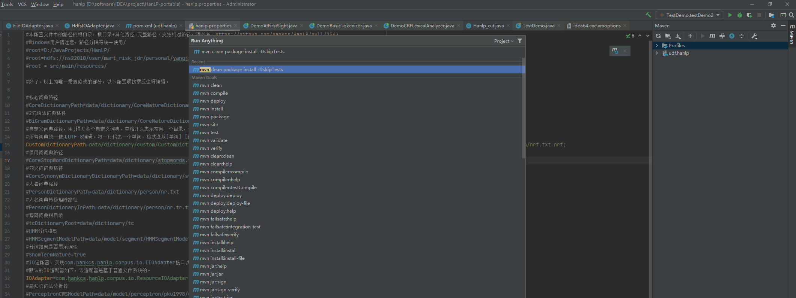

<div id="navifation" class='headbar'>
    <iframe id='head' align="center" width="100%" height="160" src=""  frameborder="no" border="0" marginwidth="0" marginheight="px" scrolling="no" ></iframe>
</div>
<style>
    .headbar{text-align:center;background-color:white}
    .iframe{margin:0 auto;}
</style>
<script>
    var oDiv = document.getElementById('head');
    oDiv.style.position = 'fixed'; oDiv.style.top = '0px'; oDiv.style.left = '0px';
    document.title="hanlp的java版本";
    document.querySelector("body > div > h1 > a").innerHTML=''
</script>
<br><br>

# hanlp的java版本（protable版本）部署

【ps：主要面向没有学过java，且第一次使用IDEA的玩家，最终目的是打包成jar包放到hdfs集群上，在写sql时调用】

```sqql
ADD jar <jar包的hdfs路径>;
CREATE TEMPORARY
    FUNCTION hanlp
    AS
        'com.udf.hanlp.Hanlp_cut';
        SELECT hanlp('呜呜怪喵喵怪和哈哈怪')
```

- [本地运行](#本地运行)
    - [一、下载源码](#一下载源码)
    - [二、打开项目](#二打开项目)
    - [三、运行deom](#三运行deom)
    - [四、引入新的hadoop依赖包](#四引入新的hadoop依赖包)
    - [五、自定义class](#五自定义class)
- [打包jar包](#打包jar包)
    - [一、Hanlp的文件读取](#一hanlp的文件读取)
    - [二、新增hdfs的文件读取](#一hanlp的文件读取)
    - [三、修改pom.xml](#三修改pomxml)
    - [四、将资源文件打包进jar包](#四将资源文件打包进jar包)
    - [五、将资源文件不打包进jar包](#五将资源文件不打包进jar包)
- [IDEA的设置](#idea的设置)


### 本地运行

##### 一、下载源码
- protable版本：<https://github.com/hankcs/HanLP/tree/portable>
- 在README中找到 `data.zip` 和 `hanlp-release.zip` 的下载

##### 二、打开项目

- IDEA选择 【File】- 【Open】，然后选择项目文件夹`HanLP-portable`打开
- 在`src/main`目录下新建文件夹`resources`
- 解压 `hanlp-release.zip`，将里面的`hanlp.properties`拷贝到`resources`下
- 解压`data.zip`，将整个`data`文件夹拷贝到`resources`下。其中`data\model`是模型文件，可以先全部删掉，后续根据具体的调用，添加具体的模型。

##### 三、运行deom
- 配置`hanlp.properties` 
    1）设置`root = src/main/resources/`
    2）除了`root`和`CustomDictionaryPath`之外的配置都注释掉
- demo文件在`src/test/java/com/hankcs/demo`,选择`DemoBasicTokenizer`打开，在第22行的左边有一个绿色箭头，点击可以直接Run
- 选择`DemoCRFLexicalAnalyzer`打开，如果之前拷贝`data`文件夹时删掉了`data\model`，直接运行会找不到模型文件,可以找到对应的model复制过来

##### 四、引入新的hadoop依赖包
- 为了后面能顺利进行，在此先引入一些hadoop依赖
- 找到项目文件夹`HanLP-portable`下面的`pom.xml`文件，在`<dependencies>`标签内添加下面三个依赖
    ```java
    <dependency>
        <groupId>org.apache.hive</groupId>
        <artifactId>hive-exec</artifactId>
        <version>0.12.0</version>
        <scope>provided</scope>
    </dependency>
    <dependency>
        <groupId>org.apache.hadoop</groupId>
        <artifactId>hadoop-common</artifactId>
        <version>2.2.0</version>
        <scope>provided</scope>
    </dependency>
    <dependency>
        <groupId>org.apache.hadoop</groupId>
        <artifactId>hadoop-client</artifactId>
        <version>2.7.3</version>
        <scope>provided</scope>
    </dependency>
    ```
    然后点击IDEA最右侧上方的【Maven】，在弹出来的页面，点击菜单栏的最左边【Reload All Maven Projects】，此时会自动下载刚刚添加的依赖

##### 五、自定义class
- 在`src/main/java/com`下新建`udf`文件夹，再进入`udf`新建`hanlp`文件夹，然后IEDA中右键点刚刚新建的`udf.hanlp`，【New】-【Java Class】，新建`Hanlp_cut`class文件。
- 在`Hanlp_cut`写入如下代码：
    ```java
    package com.udf.hanlp;

    import com.hankcs.hanlp.seg.common.Term;
    import com.hankcs.hanlp.tokenizer.BasicTokenizer;
    import org.apache.hadoop.hive.ql.exec.UDF;
    import java.util.List;

    public class Hanlp_cut extends  UDF {
        public String evaluate(String text){
            List<Term> data= BasicTokenizer.segment(text);
            String hanlp_text = ((Term)data.get(0)).word;

            for(int i = 1; i < data.size(); ++i) {
                hanlp_text = hanlp_text + " " + ((Term)data.get(i)).word;
            }
            return hanlp_text;
        }

    }
    ```
    &emsp;&emsp;IDEA会根据写的代码实时自动import相关的包，但是如果一次性复制粘贴一堆代码，则不会自动引用。如果像我一样第一次写java代码，建议从public class Hanlp_cut开始手打一遍，感受一下IDEA的补全
    &emsp;&emsp;此段代码是为了打包成jar包而构建的，需要引用`UDF`，且方法名必须要为`evaluate`,该方法的参数就是写sql时传的参数。
- 使用单元测试来运行`Hanlp_cut`中的代码。在`src/test/java/com/hankcs/`下新建一个`TestDemo`class文件，写入如下代码：
    ```java
    package com.udf.hanlp;
    import com.udf.hanlp.Hanlp_cut;
    import junit.framework.TestCase;
    import org.junit.Test;

    public class TestDemo extends TestCase {
        @Test
        public void  testDemo2(){
            Hanlp_cut hanlp_cut= new Hanlp_cut();
            System.out.println(hanlp_cut.evaluate("呜呜怪喵喵怪和哈哈怪"));
        }
    }
    ```
    在public void  testDemo2()旁边就会有绿色箭头，点击则可以直接Run

    以上，可以进行本地开发和调试。

### 打包jar包
##### 一、Hanlp的文件读取
- 所有的内置文件的默认路径为相对路径，在`hanlp.properties`中设置`root`，会在`root`目录下拼接相对路径然后读取
- portable版本中内置了两种文件读取的方式（IO适配器），由`hanlp.properties`中的`IOAdapter`设置
    1）设置`IOAdapter=com.hankcs.hanlp.corpus.io.FileIOAdapter`：从设置的`root`目录下读取文件
    2）设置`IOAdapter=com.hankcs.hanlp.corpus.io.ResourceIOAdapter`：从当前项目的resources目录下读取文件，此时可以将`root`注释掉
- 以上两种读取方式，适用于windows和linux的文件系统

##### 二、新增hdfs的文件读取
- 如果需要读取hdfs的文件，则需要单独新增一个IO适配器
- 在`src/main/java/com/hankcs/hanlp/corpus/io`下新建一个`HdfsIOAdapter`class文件，写入如下代码：
    ```java
    package com.hankcs.hanlp.corpus.io;

    import org.apache.hadoop.conf.Configuration;
    import org.apache.hadoop.fs.FileSystem;
    import org.apache.hadoop.fs.Path;

    import java.io.IOException;
    import java.io.InputStream;
    import java.io.OutputStream;
    import java.net.URI;

    public class HdfsIOAdapter implements IIOAdapter {
        @Override
        public InputStream open(String path) throws IOException {
            Configuration conf = new Configuration();
            FileSystem fs = FileSystem.get(URI.create(path),conf);
            return fs.open(new Path(path));
        }

        @Override
        public OutputStream create(String path) throws IOException {
            Configuration conf =new Configuration();
            FileSystem fs =FileSystem.get(URI.create(path),conf);
            return  fs.create(new Path(path));
        }
    }
    ```
    依然不建议将这段代码直接复制到IDEA中，建议手打一遍。并且有部分方法（函数）会在不同的包中重复，比如`Configuration`会出现在不同的包中，注意看IDEA补全提示中，选择`org.apache.hadoop.conf.Configuration`
##### 三、修改pom.xml
- 将hanlp.properties打包入jar包，在`pom.xml`找到下面这段，注释掉
    ```
    <!-- 打包插件，排除语料库和语料库工具以及日志配置文件 -->
        <plugin>
            <groupId>org.apache.maven.plugins</groupId>
            <artifactId>maven-jar-plugin</artifactId>
            <version>${maven-jar-plugin.version}</version>
            <configuration>
                <excludes>
                    <exclude>**/*.properties</exclude>
                </excludes>
            </configuration>
        </plugin>
    ```
- 再次说明，本篇的所有操作都是为了（打包成jar包放到hdfs集群上，在写sql时调用）,其他场景具体情况具体分析。

##### 四、将资源文件打包进jar包
- 应该先在上述的单元测试完成之后再进行jar包的打包
- 资源文件指`data`文件夹，其中`data`文件夹里又包含`dictionary`（字典）和`model`（模型）
- 将`data`打包进jar，则整个项目只需要jar包就能运行，但是需要考虑当前使用的模型文件的大小，如果将下载的`data`文件夹全部打入jar包，则jar包大小有600+M。
- 首先，配置`hanlp.properties` 
    1）将`root`注释掉
    2）设置`IOAdapter=com.hankcs.hanlp.corpus.io.ResourceIOAdapter`
-  然后点击IDEA最右侧上方的【Maven】，在弹出来的页面，点击菜单栏的【Execute Maven Goal】（图标是字母M），接着在弹出来命令行输入`mvn clean package install -DskipTests`，回车即可以打包为jar包。
- 打包好的jar包在`target`目录下
    <center>
    
    </center>
- 最后将jar包上传集群，在sql里add jar即可直接调用


##### 五、将资源文件不打包进jar包
- 可以将下载的`data`文件夹上传hdfs，这样一方面是方便更新字典和模型文件，另一方面也是减少jar包的大小
- 首先，配置`hanlp.properties` 
    1）设置`root = <data文件夹的hdfs路径>`
    2）设置`IOAdapter=com.hankcs.hanlp.corpus.io.HdfsIOAdapter`
- 其余步骤同上

### IDEA的设置
1. 报错OOM：
    - 1）IDEA全局内存配置【File】-【Setings】-【Build,Execution,Deployment】-【Compiler】配置
    - 2）虚拟机全局内存配置【Help】-【Eidt Custom VM Options】配置
    - 3）当前运行的虚拟机内存配置【Run】-【Eidt Configuration】配置（优先试一试这个）