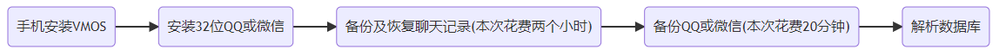

<div id="navifation" class='headbar'>
    <iframe id='head' align="center" width="100%" height="160" src=""  frameborder="no" border="0" marginwidth="0" marginheight="px" scrolling="no" ></iframe>
</div>
<style>
    .headbar{text-align:center;background-color:white}
    .iframe{margin:0 auto;}
</style>
<script>
    var oDiv = document.getElementById('head');
    oDiv.style.position = 'fixed'; oDiv.style.top = '0px'; oDiv.style.left = '0px';
    document.title="导出QQ聊天记录和微信聊天记录";
    document.querySelector("body > div > h1 > a").innerHTML=''
</script>
<br><br>

# 导出QQ聊天记录和微信聊天记录

<font color=red>【ps：本方法只提取文本消息，不含图片、视频、表情、连接】</font>

<!-- [设备环境](###设备环境) -->
<!-- [toc] -->

- [导出QQ聊天记录和微信聊天记录](#导出qq聊天记录和微信聊天记录)
    - [1.环境](#1环境)
    - [2.总体流程](#2总体流程)
    - [3.导出QQ聊天记录](#3导出qq聊天记录)
        - [第一步：安装VMOS](#第一步安装vmos)
        - [第二步：安装32位QQ](#第二步安装32位qq)
        - [第三步：备份和恢复聊天记录](#第三步备份和恢复聊天记录)
        - [第四步：在VMOS中备份QQ](#第四步在vmos中备份qq)
        - [第五步：找到聊天记录数据库（QQ号.db）](#第五步找到聊天记录数据库qq号db)
        - [第六步：解析聊天记录](#第六步解析聊天记录)
    - [4.导出微信聊天记录](#4导出微信聊天记录)
        - [第一步：安装VMOS](#第一步安装vmos-1)
        - [第二步：安装32位微信](#第二步安装32位微信)
        - [第三步：备份和恢复聊天记录](#第三步备份和恢复聊天记录-1)
        - [第四步：在VMOS中备份微信](#第四步在vmos中备份微信)
        - [第五步：找到聊天记录数据库（EnMicroMsg.db）](#第五步找到聊天记录数据库enmicromsgdb)
        - [第六步：解析聊天记录](#第六步解析聊天记录-1)

### 1.环境

- 华为手机 + 鸿蒙2.0.0 + Windows

- 解析聊天记录文本需要 Python 和 sqlcipher

### 2.总体流程


- QQ微信聊天记录可以直接从手机备份到电脑，但是备份出来的文件无法查看内容。

- 同时，手机中的聊天记录保存的文件一般情况下是无法找到的。如果不root手机的话，可以使用【备份整个APP】的方法可以帮助导出聊天记录保存文件。

- 但是由于现在华为自带的备份软件的备份APP时候需要加密，导出也无法查看，所以借用了安卓虚拟系统VMOS来备份整个APP。

- VMOS可以理解为，在手机中单独分一块空间出来当成一个虚拟新手机，这个新手机自带有一个备份功能，备份时候无需加密。

- 安装好VMOS后，需要在VMOS中再安装QQ或微信，但是这个虚拟新手机中的QQ或微信没有任何聊天记录。

- 因此，需要事先将手机中的聊天记录备份到电脑，再从电脑恢复到虚拟新手机中，此时再在虚拟新手机中【备份整个APP】就行了




### 3.导出QQ聊天记录

##### 第一步：安装VMOS

- VMOS官网：<http://www.vmos.cn/>，下载到手机上，安装
  
- 【不使用VMOS Pro是因为它没有备份APP的功能】

##### 第二步：安装32位QQ

- VMOS中只支持32位的APP
- QQ：<https://im.qq.com/mobileqq>，扫描下载32位版本
- 下载安装包之后，注意一下后缀名是不是.apk，如果多了字符（比如.apk.1），删掉多余的字符
- 打开VMOS，再打开（文件中转站），点击（我要导入），找到刚刚下载的安装包，导入会自动安装
- 【安装可能有点慢，安装完之后可能等一等才会显示安装成功】

##### 第三步：备份和恢复聊天记录

- 手机和电脑都登录QQ，在同一个wifi下，备份手机聊天记录到电脑，可以选指定的会话【挺快】
- 在VMOS中登录QQ，在同一个wifi下，恢复电脑聊天记录到手机，也可以选指定的会话【慢得要死】
  

##### 第四步：在VMOS中备份QQ

- 打开VMOS中的（备份与恢复），点击(新建备份)，选中（应用程序）中的（QQ）,开始备份
- 备份整个APP的结果存在（`内部储存/VMOSfiletransferstation/Vmos_Backups`）下面，QQ的备份一般叫（com.tencent.mobileqq.tar.gz）
- 【需要手机有足够的内存，如果备份的时候卡了二十分钟没有进度，直接后台清除VMOS重新来】

##### 第五步：找到聊天记录数据库（QQ号.db）

- 将备份整个APP的结果（com.tencent.mobileqq.tar.gz）拷到电脑上，解压
- 在(`com.tencent.mobileqq.tar\com.tencent.mobileqq\databases`)文件夹下找到一个（你的QQ号.db）文件
- 【一般来说，上述文件夹有三个文件存有聊天记录，(QQ号-IndexQQMsg.db)和(QQ号.db)存有近21天记录，(slowtable_QQ号.db)存有21天之前的记录。】
- 【但是可能是由于此方法是在新装的QQ上导入聊天记录，所以所有的聊天记录都在（你的QQ号.db）文件中】

##### 第六步：解析聊天记录
- 找到密钥
在用记事本打开(`com.tencent.mobileqq.tar\com.tencent.mobileqq\files\kc`)，可以看到字符串（比如12:34:56:2a:6b:cd），就是密钥
- 使用python解析聊天记录，需要在最下方配置参数，<font color=red>用于提取某一个特定会话的聊天记录</font>
  【这里提取的记录以文本信息保存，但是含有表情、图片、连接的源码或引用源码，所有下一步可以考虑清洗数据】
    ```python
    from _overlapped import NULL
    import hashlib
    import sqlite3
    import time
    import traceback
    import os


    class QQoutput():
        def __init__(self, db, key, mode):
            self.key = key  #解密用的密钥
            self.c = sqlite3.connect(db).cursor()
            self.mode = mode
            # self.s = s

        def fix(self, data, mode):
            #msgdata mode=0
            #other mode=1
            if (mode == 0):
                rowbyte = []
                for i in range(0, len(data)):
                    rowbyte.append(data[i] ^ ord(self.key[i % len(self.key)]))
                rowbyte = bytes(rowbyte)
                try:
                    msg = rowbyte.decode(encoding="utf-8")
                except:
                    msg = NULL
                return msg
            elif (mode == 1):
                str = ""
                try:
                    for i in range(0, len(data)):
                        str += chr(ord(data[i]) ^ ord(self.key[i % len(self.key)]))
                except:
                    str = NULL
                return str

        def decode(self, cursor):
            for row in cursor:
                continue
            data = row[0]
            MsgEnc = self.s.encode(encoding="utf-8")
            KeySet = ""
            #for i in range(0,min(len(MsgEnc), len(data))):
            for i in range(0, len(MsgEnc)):
                KeySet += chr(data[i] ^ MsgEnc[i])
            #TO AVOID LOOP
            RealKey, restKey = "", ""
            for i in range(4, len(KeySet)):
                '''
                bug WARNING!!
                Assuming Key should be longer than 5 digits
                To Prevent string loop in single key
                Like "121212456"
                '''
                RealKey, nextKey, restKey = KeySet[0:i], KeySet[i:2 * i], KeySet[
                    2 * i:len(KeySet)]
                KeyLen = len(RealKey)
                flagLoop = True
                for j in range(KeyLen):
                    if ((j < len(nextKey) and RealKey[j] != nextKey[j])
                            or (j < len(restKey) and RealKey[j] != restKey[j])):
                        flagLoop = False
                        break
                if (flagLoop and j == KeyLen - 1):
                    break
            return RealKey

        def AddEmoji(self, msg):
            pos = msg.find('\x14')
            while (pos != -1):
                lastpos = pos
                num = ord(msg[pos + 1])
                msg = msg.replace(
                    msg[pos:pos + 2],
                    "")
                pos = msg.find('\x14')
                if (pos == lastpos):
                    break
            return msg

        def message(self, num_in, mode):
            #mode=1 friend
            #mode=2 troop
            num = str(num_in).encode("utf-8")
            md5num = hashlib.md5(num).hexdigest().upper()
            if (mode == 1):
                execute = "select msgData,senderuin,time from mr_friend_{md5num}_New".format(
                    md5num=md5num)
            elif (mode == 2):
                execute = "select msgData,senderuin,time from mr_troop_{md5num}_New".format(
                    md5num=md5num)
            else:
                print("error mode")
                exit(1)
            #try:
            cursor = self.c.execute(execute)
            #except:
            #    raise ValueError("QQ号/db地址错误")
            if (self.key == "" and len(self.s) >= 5):
                self.key = self.decode(cursor)
            cursor = self.c.execute(execute)
            allmsg = []
            count=0
            for row in cursor:
                msgdata = row[0]
                if (not msgdata):
                    continue
                uin = row[1]
                ltime = time.localtime(row[2])

                sendtime = time.strftime("%Y-%m-%d %H:%M:%S", ltime)
                msg = self.fix(msgdata, 0)
                senderuin = self.fix(uin, 1)
                # print(num_in)
                isSend='0' if senderuin==num_in else '1'
                amsg = []
                amsg.append(sendtime)
                # amsg.append(senderuin)
                amsg.append(isSend)
                amsg.append(str(msg))
                allmsg.append(amsg)
            return allmsg

    def main(db, qq, key,now_name):
        mode = 1

        q = QQoutput(db, key, mode)
        allmsg = q.message(qq, mode)
        print('allmsg num:',len(allmsg))

        os.makedirs(now_name,exist_ok=True)
        save_file=os.path.join(now_name,now_name+'_origin.txt')
        with open(save_file,'w',encoding='utf-8') as f:
            for msg in allmsg:
                f.write(str(msg)+'\n')


    if __name__=='__main__':
        db = "QQ号.db"                  # 文件位置
        key=''                          # 密钥
        qq = ""                         # 指定某一个会话的QQ号（比如某一个好友的QQ号）
        now_name=''                     # 最后保存聊天记录文件的名字（比如好友的名字）
        main(db, qq, key, now_name)
    ```
- 清洗聊天记录，只保留文本信息
    ```python
    import time
    import os
    import re

    def textclean(now_name):
        count=0
        file=os.path.join(now_name,now_name+'_origin.txt')
        newfile=os.path.join(now_name,now_name+'_clean.txt')
        with open(newfile,'w',encoding='utf-8') as w:
            with open(file,'r',encoding='utf-8') as f:
                for data in f.readlines():
                    [sendtime,isSend,content] = eval(data)
                    # print(content)

                    if(content=='0'):
                        continue

                    if('QQfile_recv' in content or 'http' in content or 'bgColor' in content
                    or 'plaintext' in content or 'ed2k:' in content or '.exe' in content or
                    '.xls' in content or '.docx' in content or '.ppt' in content or '*****' in content
                    or '撤回了一条消息' in content):
                        continue

                    content=replace_emoji(content)
                    if(content==''):
                        continue

                    # print(content)
                    w.write(str([sendtime,isSend,content])+'\n')
                    count+=1

        print(count)

    def replace_emoji(my_str):
        rep = {"\x14\x8d": "", "\x14¨": "","\x14®": "","\x14\x97": "","\x14\x8f": "","\x14³": "",
            "\x14O": "","\x14ª": "","\n": "","\x14Ñ": "","\x14»": "","\x14 ": "","\x14\x0f": "",
            "\x144": "","\x14©": "","\x14\x17": "","\x14X": "","\x14«": "","\x14¡": "","\x140": "",
            "\x14\x11": "","\x14F": "","\x14c": "","\x14S": "","\x14¬": "","\x14R": "","\x14\t": "",
            "\x14¦": "","\x14\x15": "","\x14\x95": "","\x14\x93": "","\x14)": "","\x14\x99": "",
            "\x14\x98": "","\x14\x1c": "","\x14#": "","\x14¯": "","\x14G": "","\x14@": "",
            "\x14\x01": "","\x14N": "","\x14đ": "","\x14Ć": "","\x16": "","\x14ċ": "","\x14\x92": "",
            "\x145": "","\x14ą": "","\x14U": "","\x14'": "","\x14Ì": "","\x14\x1e": "",
            "\x03101\x12\x00\x1a\x00": "","\xa0": "","\x14½": "","\x14¹": "","\x14¥":"",'\x14ć':"","\x14Ø":"",
            "\x14ġ":"",'\x14Ń':'',"\x14Ċ":'','\x14ĉ':"","\x14Ĉ":'','\x14a':'',
            "\x011\x12\x0216\x18\x05 \x01(\x012\x00:\x07/流泪B\x00H\x01\x00\x00":'',}
        rep = dict((re.escape(k), v) for k, v in rep.items())
        pattern = re.compile("|".join(rep.keys()))
        my_str = pattern.sub(lambda m: rep[re.escape(m.group(0))], my_str)
        return my_str


    if __name__=='__main__':
        now_name=''                  # 上一步设置的最后保存聊天记录文件的名字（比如好友的名字）
        textclean(now_name)
    ```

### 4.导出微信聊天记录

##### 第一步：安装VMOS

- 同上

##### 第二步：安装32位微信

- 同上
- 微信：<https://weixin.qq.com/>，点击（微信 x.x.x Android正式版发布）,然后下载32位版本

##### 第三步：备份和恢复聊天记录

- 同上
- 【指定少数人之后，微信的备份和恢复还是比较快的】

##### 第四步：在VMOS中备份微信

- 同上
- 微信的备份一般叫（com.tencent.mm.tar.gz）


##### 第五步：找到聊天记录数据库（EnMicroMsg.db）

- 将备份整个APP的结果（com.tencent.mm.tar.gz）拷到电脑上，解压
- 在(`com.tencent.mm.tar\com.tencent.mm\MicroMsg`)`文件夹下，找到名字是16进制字符且比较长的文件夹（类似于47e2b5ca90cda7d8a508e11a6fecfa26）
- 这样的文件夹可能会有多个，其实是对应手机曾经登录的多个微信。但是每一个文件夹里面都会含有（EnMicroMsg.db）文件
- 找到最大的（EnMicroMsg.db）文件，毕竟自己的微信聊天记录肯定是最多的，除非想提取微信小号的聊天记录，那就一个一个尝试。
【白痴问题：一开始没找到（EnMicroMsg.db）文件，搜索了好久，结果发现是自己解压的时候中断了，没有完全解压出来】

##### 第六步：解析聊天记录

- 找到uin值
  记事本打开（`com.tencent.mm.tar\com.tencent.mm\shared_prefs\auth_info_key_prefs.xml`）, 找到类似于`<int name="_auth_uin" value="-2069473988" />`，这里的value后面的值就是uin值，正负数都有可能
- 找到密钥
  不同微信版本密钥可能不一样，之前的说法有（IMEI值和uin值拼接形成字符串）的32位小写MD5加密的前七位，上一次提取记录确实就是这样的密钥。
  但是时间推移，本次的密钥实际是（1234567890ABCDEF和uin值拼接）的32位小写MD5加密的前七位。
  即，(1234567890ABCDEF-2069473988)经过32位MD5加密后小写的前七位。
- 打开数据库
  下载sqlcipher <https://pan.cstcloud.cn/s/xekJrl6DTI>，也可以自行网上搜索下载。然后将（EnMicroMsg.db）文件拖入，输入密钥打开
- 导出CSV
  依次点击(File-Export-Table as CSV file)，选择Table name为（message），一般下拉菜单在最下边，导出
- 使用python解析聊天记录，需要在最下方配置参数，<font color=red>用于提取某一个特定会话的聊天记录</font>
  【这里提取的记录以文本信息保存，但是含有表情、图片、连接的源码或引用源码，所有下一步可以考虑清洗数据】
    ```python
    import os
    def csv2txt(file,result,now_id,now_name):
        with open(file,'rb') as f:
            start_count=0
            count=0
            start=0
            max=200
            # now_id='"wxid_h1hq379r4ea322"'
            now_messge=[]
            messge_time=[]
            messge_dict={}
            for data in f.readlines():
                start_count+=1
                if(start_count>start):
                    # print(data)
                    lis = data.decode('gb18030','ignore').split(',')
                    # print(lis)
                    try:
                        [msgid,isSend,createTime,talker,content]=[lis[0],lis[4],lis[6],lis[7],lis[8]]
                        if (('wxid' not in talker) or ('wxid' in content) or ('?xml' in content)):
                            continue
                        # print([msgid,isSend,createTime,talker,content])
                        if(talker==now_id):
                            now_messge.append([msgid,isSend,createTime,content])
                            messge_dict[str(createTime)]=[msgid,isSend,createTime,content]
                            messge_time.append(createTime)
                            count += 1
                    except:
                        pass

                    if(start_count%200000==0):
                        print('swap lines:',start_count)

                # if(count>max):
                #     break
        print(len(now_messge))

        messge_time.sort()
        save_file=os.path.join(result,now_name,now_name+'_origin.txt')
        with open(save_file,'w',encoding='utf-8') as w:
            for key in messge_time:
            # for data in now_messge:
                data=messge_dict[str(key)]
                w.write(str(data)+'\n')

    if __name__=='__main__':
        file=".csv"                             # CSV文件位置
        now_id='"wxid_xu9z2jm5x1l622"'          # 某个会话的id，实际就好友的微信号，在手机可以看，注意需要有双引号
        result=''                               # 保存聊天记录的文件夹
        os.makedirs(result,exist_ok=True)
        now_name=''                             # 保存聊天记录的文件（比如当前好友的名字）
        os.makedirs(os.path.join(result,now_name), exist_ok=True)
        csv2txt(file,result,now_id,now_name)
    ```

- 清洗聊天记录，只保留文本信息
    ```python
    import time
    import os
    import re
    def textclean(file,newfile,now_name,):
        count=0
        with open(newfile,'w',encoding='utf-8') as w:
            with open(file,'r',encoding='utf-8') as f:
                for data in f.readlines():
                    [msgid,issend,sendtime,content]=eval(data)
                    # print([msgid,issend,sendtime,content])
                    issend = issend[1:-1]
                    time_local = time.localtime(int(sendtime[1:-1])/1000)
                    dt = time.strftime("%Y-%m-%d %H:%M:%S", time_local)
                    # print(dt)
                    content=content[1:-1]
                    if(('撤回了一条消息' in content) or ('<msg>' in content) or ('<img src=' in content) or ('http' in content) or ('??【') in content):
                        continue

                    content=replace_emoji(content)
                    if(content==''):
                        continue

                    w.write(str([dt,issend,content])+'\n')
                    count+=1
        print(count)

    def replace_emoji(my_str):
        rep = {"\x14\x8d": "", "\x14¨": "","\x14®": "","\x14\x97": "","\x14\x8f": "","\x14³": "",
            "\x14O": "","\x14ª": "","\n": "","\x14Ñ": "","\x14»": "","\x14 ": "","\x14\x0f": "",
            "\x144": "","\x14©": "","\x14\x17": "","\x14X": "","\x14«": "","\x14¡": "","\x140": "",
            "\x14\x11": "","\x14F": "","\x14c": "","\x14S": "","\x14¬": "","\x14R": "","\x14\t": "",
            "\x14¦": "","\x14\x15": "","\x14\x95": "","\x14\x93": "","\x14)": "","\x14\x99": "",
            "\x14\x98": "","\x14\x1c": "","\x14#": "","\x14¯": "","\x14G": "","\x14@": "",
            "\x14\x01": "","\x14N": "","\x14đ": "","\x14Ć": "","\x16": "","\x14ċ": "","\x14\x92": "",
            "\x145": "","\x14ą": "","\x14U": "","\x14'": "","\x14Ì": "","\x14\x1e": "",
            "\x03101\x12\x00\x1a\x00": "","\xa0": "","\x14½": "","\x14¹": "","\x14¥":"",'\x14ć':"","\x14Ø":"",
            "\x14ġ":"",'\x14Ń':'',"\x14Ċ":'','\x14ĉ':"","\x14Ĉ":'','\x14a':'',"\ue412":'','\ue40d':'',
            "\x011\x12\x0216\x18\x05 \x01(\x012\x00:\x07/流泪B\x00H\x01\x00\x00":'',
            '\ue40e':'','\ue403':''}
        rep = dict((re.escape(k), v) for k, v in rep.items())
        pattern = re.compile("|".join(rep.keys()))
        my_str = pattern.sub(lambda m: rep[re.escape(m.group(0))], my_str)
        return my_str

    if __name__=='__main__':

        result=''                                       # 上一步设置的，保存聊天记录的文件夹
        # os.makedirs(result,exist_ok=True)
        now_name=''                                     # 上一步设置的，保存聊天记录的文件（比如当前好友的名字）
        # os.makedirs(os.path.join(result,now_name), exist_ok=True)
        file = os.path.join(result, now_name, now_name + '_origin.txt')
        # now_name='luoran'
        newfile = os.path.join(result,now_name, now_name + '_clean.txt')

        textclean(file,newfile,now_name)
    ```